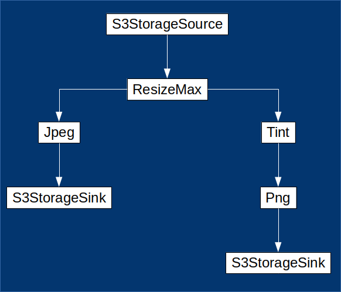

==========
API Access
==========

Overview
========

The first step is to obtain a valid *Bearer Token* using your API Keys as described below. The token that you receive is then used by one of our API Clients (or your own) in order to send *Batches* of image processing tasks to the API. Each *Batch* consists of a collection of *Transform Graphs*, and each  *Transform Graph* describes the source, operations and destination(s) for an image processing task. 

Getting Authorized
==================

Access to the Pixelshift API is secured via OAuth 2.0 authorization using the `Client Credentials grant type <https://www.oauth.com/oauth2-servers/access-tokens/client-credentials/>`_. All requests to the API must include a valid access-token. The steps to accquire this token are outlined below.

**1. Generate API Public/Private Key Pair**

Visit your :webroot:`Pixelshift Dashboard <Dashboard/ApiAccess>` and hit 'Generate New Api Key'. Store both keys somewhere safe (please note that the Private Key is only available when a new key is generated though a new Private Key can be generated at any time).

----

**2. Accquire an OAuth 2.0 Access Token**

Using your technology of choice, make a POST to http://www.pixelshift.io/connect/token with a POST body of :code:`{ grant_type : "client_credentials"}` and your API Keys Base64 Encoded in the Authorization Header. For example, using Node.js this would look like:

.. code-block:: javascript
    :linenos:

    const https = require('https');
    const querystring = require('querystring');
    const postData = querystring.stringify({ grant_type: "client_credentials" });
    const clientId = "XXXXXXXXX";
    const clientSecret = "XXXXXXXXXXX";;
    const credentials = Buffer.from(clientId + ':' + clientSecret).toString('base64');
    
    var options = {
        hostname: 'www.pixelshift.io',
        path: '/connect/token',
        method: 'POST',
        headers: {
            'Content-Type': 'application/x-www-form-urlencoded',
            'Content-Length': postData.length,
            'Authorization' : 'Basic ' + credentials
        }
    };
    
    const req = https.request(options, (res) => {
        let data = '';
        res.on('data', d => {
            data += d;
        });
        res.on('end', () => {
            const response = JSON.parse(data);
            console.log(response.access_token);
        });
    });
    req.write(postData);
    req.end();

Creating an API Client
======================

The details of this step depend on your chosen language and implementation. 

If you are using C#, Node.js or Java the quickest route to an API Client is to clone one of `our repositories <https://github.com/pixel-shift>`_. If you are using Python, Ruby or Typescript, you can generate a client automatically using `autorest <https://github.com/Azure/autorest>`_ against our :webroot:`Swagger/OpenAPI document <swagger/v1/swagger.json>`.

.. important::
    Although autorest can generate clients in **Node.js**, it requires a workaround. If you're using Node, clone from our `Node.js Client repo <https://github.com/pixel-shift/node-js-client>`_ instead of rolling your own.

Once you have a client, it needs to be initialized with the OAuth token accquired in the previous step. As an example, the Node.js client is initialized as follows:

.. code-block:: javascript
    :linenos:

    const creds = new TokenCredentials(token);
    const api = new PixelshiftApi(creds, "https://www.pixelshift.io");

Defining Processing Tasks 
===============================================

Transform Units and Transform Graphs
------------------------------------

The core building blocks of processing tasks are abstract entities called *Transform Units*. Sources, Sinks and Operations such as resizing and cropping are all *Transform Units*. Processing tasks are described by chains of *Transform Units* that have been assembled into *Transform Graphs*.

*Transform Graphs* consist of one or more *Transform Units* and zero or more *Output Transform Graphs* (which are themselves *Transform Graphs*).

Simple Transform Graphs
--------------------------

   A simple TransformGraph.

The diagram above shows a simple standalone *Transform Graph* consisting of 4 *Transform Units* and no *Outputs*. This *Transform Graph* will fetch an image from S3 Storage, resize it once and then store it as a new jpeg in S3 Storage. For any set of operations with a single output file, a standalone *Transform Graph* is sufficient. 

Branching Transform Graphs
---------------------------------

A more complex operation, such as resizing a single image multiple times, or storing a resized image as multiple formats, requires nested, or branching *Transform Graphs*:

   A branching TransformGraph.

The above is equivalent to the following:

   Data flow in a branching TransformGraph.

Valid Transform Graphs
-------------------------

There are no restrictions on how *Transform Graphs* are assembled, but in order to be valid, each chain of *Transform Units* that results must:

**1. Begin with a single StorageSource**, giving the location of the original image to be processed

**2. Contain one or more Operations**, describing the processing tasks to be performed

**3. End with an ImageFormat and a StorageSink node** that define the file type and location for the result.

Simple Example
----------------

The sample below shows how to use the the Pixelshift Node.js API Client to build a simple *Transform Graph* to fetch and image, resize it and then store it:

.. code-block:: javascript
    :linenos:

    //create StorageSource
    const storageSource = new PixelshiftApiModels.StorageSourceS3();
    storageSource.sourceBucket = "mysourcebucket";
    storageSource.sourceKey = "source-image.jpg";

    //create an ImageResizeMax transform node
    const resize = new PixelshiftApiModels.ImageResizeMax();
    resize.width = 500;
    resize.height = 500;
    
    //define output file format
    const jpeg = new PixelshiftApiModels.ImageFormatJpeg();
    jpeg.quality = 60;

    //define destination
    const storageSink = new PixelshiftApiModels.StorageSinkS3();
    storageSink.allowOverwrite = true;
    storageSink.destinationBucket = "destbucket";
    storageSink.destinationKey = "processed-image.jpg";

    //build transform graph
    const graph = new PixelshiftApiModels.TransformGraph();
    graph.transforms = [storageSource, resize, jpeg, storageSink];

Submitting a Batch
==================

*Transform Graphs* are attached to a *Batch*, which is then submitted for processing. Using Node.js again as an example, this is achieved as follows:

.. code-block:: javascript
    :linenos:
    :emphasize-lines: 4,5

    const batch = new PixelshiftApiModels.Batch();
    batch.items = [graph];

    //Note: this is only required for Node.js clients
    addTypeDiscriminatorsToBatch(batch);
    
    const apiResponsePromise = api.processImageBatch({ batch });
    let apiResponse;
    try{
        apiResponse = await apiResponsePromise;
    }catch(err){
        console.log(err);
    }
    
    console.log(JSON.stringify(apiResponse, null, 2));

**Please Note:** Line 5 in the above code is only required for Node.js clients (see our `example in github <https://github.com/pixel-shift/node-js-client/blob/master/client/index.js>`_ for the implementation of :code:`addTypeDiscriminatorsToBatch`).

The response will indicate success or, if a non-2xx HTTP status is returned, the reason that the submission has failed. See :code:`BatchStartReportResponse` in our :webroot:`swagger documentation <swagger/index.html#model-BatchStartReportResponse>`.

Supported Operations
====================

Pixelshift supports all the usual image manipulations such as resizing, colouring, cropping and even auto-cropping. Please refer to the *Models* section of the :webroot:`swagger info page <swagger/index.html>` for the full list, including detailed descriptions for each.

Throttling
==========

A Throttle setting is provided in your :webroot:`Dashboard <dashboard/apiaccess#throttling` to prevent accidental submission of more processing tasks than you intend. Use the controls to set a limit on your API access in order to reduce the impact of accidents, should they occur. Initially this is set to 1000 transforms per hour, though it can be changed whenever and as often as you wish.

Limits
======

The following limits apply to Batches submitted to the API:

* Maximum Batch size: 1000
* Maximum *StorageSinks* per *Transform Graph*: 5
* Maximum source image file size: 800MB
